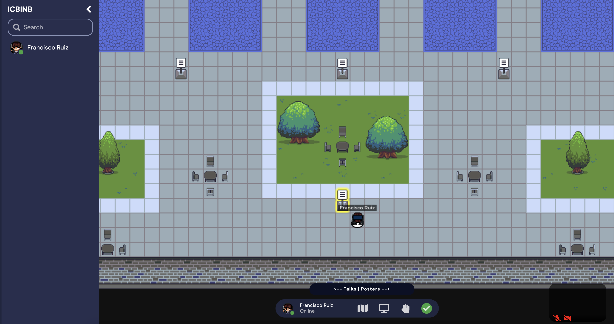
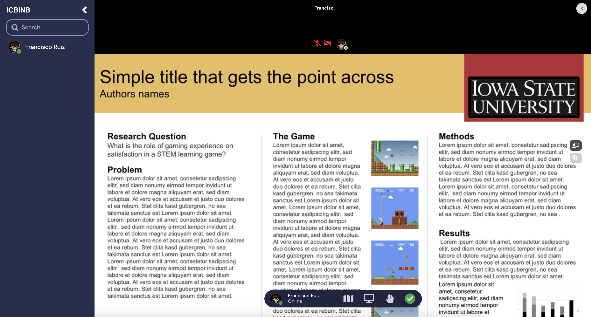
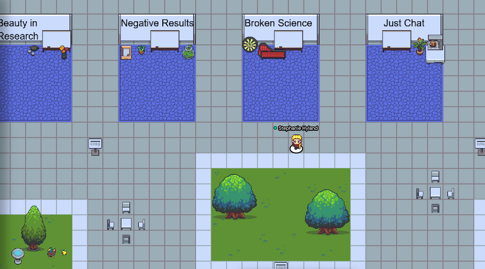
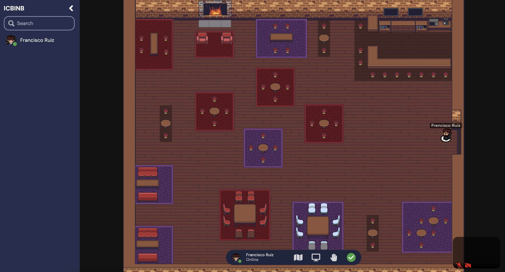
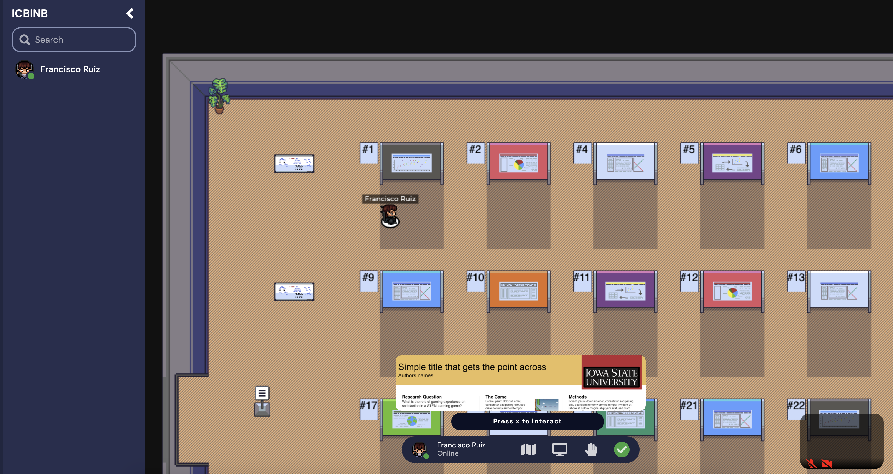

During the whole duration of the Workshop, we will enabled a virtual *Gather Town* for attendees to interact, socialize, meet new people and talk about research, either at the posters, at the breakout discussions, or at the virtual bar! To connect, simply click on the provided link (coming soon).

<figure>  <figcaption>This is the main room, where your avatar will appear.</figcaption> </figure>

<figure>  <figcaption>To the right, you will find the poster area. Press X to interact with a poster.</figcaption></figure>

<figure>  <figcaption>When watching a poster, you can click on the buttons to the right to get a laser pointer or to zoom in.</figcaption> </figure>

<figure>  <figcaption>In the main room, you can find the area for breakout discussions.</figcaption> </figure>

<figure>  <figcaption>To the left, you will find the social lounge, perfect to start new conversations!</figcaption> </figure>

<!--<figure>  <figcaption>GatherTown environment for Breakouts</figcaption> </figure>-->

<!-- <figure>  <figcaption></figcaption> </figure> -->

<!-- GatherTown is a virtual environment where you will be able to interact through video and chat with other participants. -->
