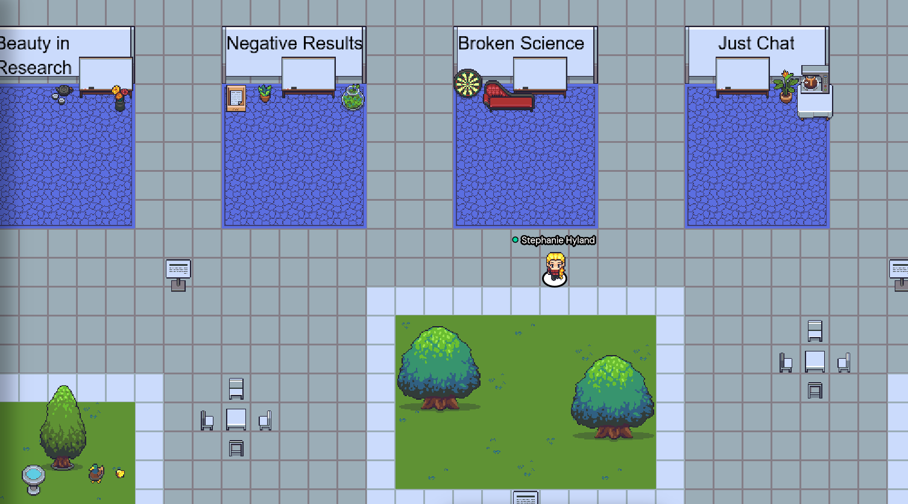

To adapt the workshop format to its virtual setting and prioritize creative discussions, we will have breakout discussions in small groups on [Gather Town](
https://eventhosts.gather.town/app/yRI5WRxMd1kkR08S/ICBINB).

<figure>  <figcaption>GatherTown environment for Breakouts</figcaption> </figure>

### What are breakouts?

A breakout is a 30min informal discussion that will take place at **14:15-14h45pm EST** on the official [Gather.Town](https://eventhosts.gather.town/app/yRI5WRxMd1kkR08S/ICBINB). The goal of this session is to share experiences related to the selected topic, find common interests, identify challenges/opportunities for improvement,  and brainstorm about ways to improve the research process overall. Each breakout will be moderated by a senior researcher, the organizers of the workshop will also be around, in case you want to meet us :)

Topics include:
    1. Role of Beauty in Machine Learning research
    2. Role of Negative Results - “file drawer”
    3. “Broken science” / incentives, reviewing, benchmarks

If you want to participate in one of these sessions, you just have to go to the corresponding "carpet" in the virtual Gather.Town world. Each carpet is a private space where you can listen to or talk to everyone else. There is one whiteboard available in each breakout. You are welcome to come by and leave anytime!

The topics are wide on purpose, so that participants have the freedom to lead the discussion to wherever they want. Here some ideas for discussion:

* Share experiences related to the topic
* What is the biggest challenge?
* Why is it difficult to fix?
* What should we be doing differently?
* How do we encourage the sharing of negative results?
* How to save papers from the graveyard of forgotten papers
